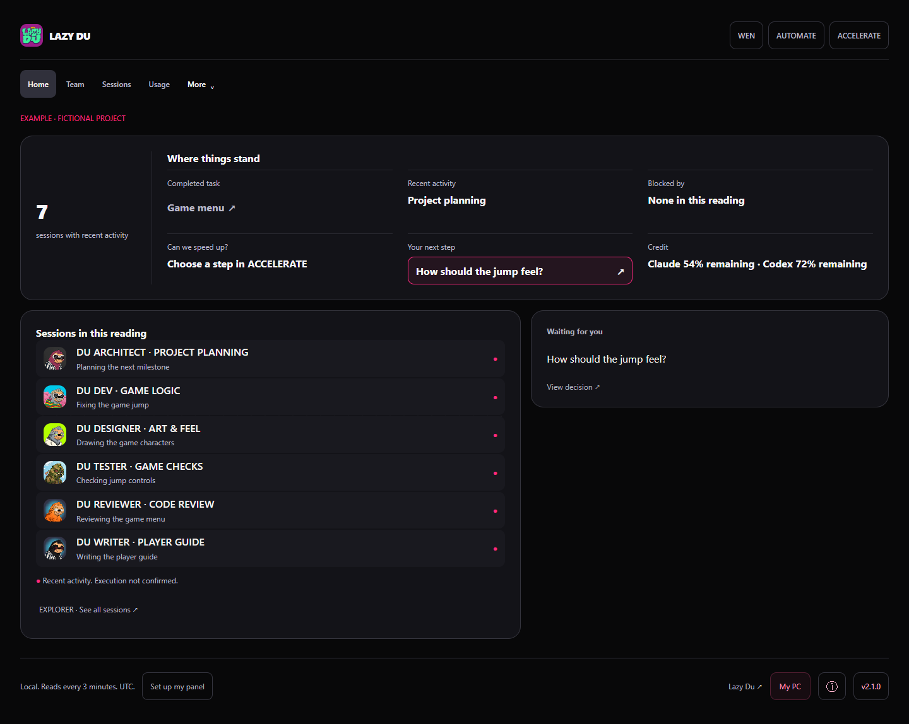
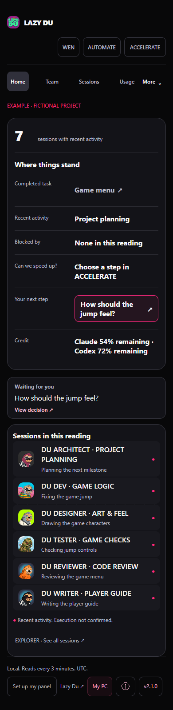

# Lazy Du Agent Panel 2.1.1

## What the panel solves

- Took on too much and got lost? See the Claude Code and Codex sessions on this computer side by side, in one place.
- Can't remember who started what? Team shows who started each session and the helpers of each one.
- Lost track of an agent? The timeline shows the tools it used and its last activity.
- Left a session open and forgot? Team separates sessions with recent activity from paused and finished ones.
- Want to know where things stand right now? WEN opens the current summary in six lines.
- Spent more than you thought? Usage shows this week's and today's tokens and how much credit has been used.
- Everything stays on your computer. No account, no key, and it reads only metadata, never your conversations.

Follow your Claude Code and Codex sessions in a local panel. Start small, switch modes whenever you need more detail.

[Português](README.pt-BR.md) · [Lazy Du](https://lazy-du.com)

## Open in under a minute

You need Node.js 20 or later. Download this repository and extract it, then:

~~~sh
node src/open.cjs
~~~

The launcher opens your browser at http://127.0.0.1:3251. On Windows you can double-click panel.bat. On macOS, run bash panel.command, or use the command above.

Choose project size, then what you want to follow. Each choice takes one click. Skip is available. Preferences lets you change the mode, language and reading options later.

No account, API key, package installation or project configuration is needed. Claude Code or Codex on this computer provides real metadata. An empty profile falls back to a clearly labelled fictional example when its scan finishes. You can choose either example at any time under More: one person or a larger team.

For an isolated example without reading local sessions:

~~~sh
node src/open.cjs --demo
~~~

The panel stays on this computer. Close panel in the footer stops a launcher with desktop shutdown enabled. Closing a browser tab alone leaves the server running. Ctrl+C stops a source server.

## If an AI runs the command

This is a local server. Run it once: the launcher keeps the server in the background. If port 3251 already answers with this version, only open http://127.0.0.1:3251. You can close the terminal; use Close panel in the footer to stop the server. Add --lang pt for Portuguese messages or --lang es for Spanish.

## What leaves your computer

Metadata and preferences stay local. Author messages are off by default and fetch the public file only after you allow them. Music and external links open only after a click. Feedback opens an issue with fixed text; you decide whether to submit it on GitHub. Check for a new version requests only the official repository's public package.json, on click, without sending metadata. Installation and updates are never automatic. The page blocks external connections outside these permitted features.

To disable author messages, version checks, music, feedback and external links:

~~~sh
node src/open.cjs --offline
~~~

If an online panel already uses that port, close it from its footer before opening offline mode.

## Three modes

| Mode | Home overview |
| --- | --- |
| BEGINNER | Up to two agents, your next step first |
| EXPLORER | Up to six agents, a small team |
| PRO | The full project and available agents |

All modes retain access to Team and its known parent relationships, Sessions, Usage, Queue and Feed your AI. The mode changes the home overview; it does not create, stop or send instructions to agents.

The home has one recent-activity count and six short lines. A recent session is observed activity, not proof that a process is still running. An ended conversation is not a delivered task. A completed task needs a recorded completion date; fictional examples label their simulated progress. Missing credit is Not available. Credit percentages say whether they are used or remaining. Tokens and credit are separate units.

Team shows you on top and Claude Code and Codex side by side, with each session and the helpers its metadata links to. Wires carry small dots in the direction of who sent, in the sender's color; idle wires stay still, and Motion off or reduced motion shows no dots. Click a wire to read who works with whom, in plain words.

Sessions shows one column per session with metadata only: state, current action, tools, model, tokens and project. It does not read or send messages. Usage starts with a one-line summary, then the week total, cups, the playful water estimate and credit rings; How we calculate explains every number.

WEN opens the current overview. AUTOMATE prepares a plan you can copy into your own AI chat. Copying the plan does not start a background agent. ACCELERATE contains a reusable work checklist, selectable gears, sequential steps and waits you mark yourself. Marking a step or picking a gear only saves it on this panel: it does not publish code, change an AI account or tell your agents anything. Minutes are self-reported waits, not a measured speed increase.

## Teach your AI and the bell

Teach your AI starts with one button: Copy and paste into Claude Code. I use Codex switches the copied request to Codex. Paste it into a chat running on your computer, in the app or terminal. The panel only copies a request; your AI saves the rules if you approve its file edit. A cloud chat must stop if it cannot reach your home folder. The rules apply to all projects through ~/.claude/CLAUDE.md or ~/.codex/AGENTS.md. Other options stays closed and includes a project-only choice and who does what.

### Exact copied rules (Claude Code, all projects)

~~~text
Save the rules below in my global ~/.claude/CLAUDE.md so they apply to all my projects. Put them in a section that starts with the title "## Lazy Du Agent Panel". If that section already exists, replace only that section: its title line and the lines starting with "- " right below it. Create the file if it does not exist. Do not delete or change anything else. Then confirm in one line. If you cannot reach my home folder from here (for example, in a cloud session), say so in one line and stop.

## Lazy Du Agent Panel: my working rules (to remove them, delete this section)
- Coordinate: the AI where I start the work coordinates and splits it into tasks; the other AI checks the plan.
- Write code: Claude Code and Codex in parallel on independent tasks (tasks that touch the same files go one after another), with the strongest model and high effort.
- Review: the other AI reviews each change; nobody reviews its own work.
- Analyze and measure: a smaller model with low effort.
- Ship to production: only after my explicit ok, by the AI that runs this project's safest checks.
- Write public text: one AI writes, the other reviews, and I approve before it goes out.
- In projects that have a tasks/ folder, keep one Markdown file per task there.
- Phases: new, open, doing, ready, review, released, done. When a task is finished, set phase: done and add completed_at: with the ISO date and time.
- Questions that need my decision go in tasks/decisions.md as numbered headings, like ## 1. Which music fits the menu? Add DONE once I answer.
~~~

The bell lists version notes and tips made on this computer, what waits for you and decisions asked by your AIs. Read marks, and the screens you opened (used only to suggest one feature you have not tried, at most one a day), stay in this browser. Author messages are off by default. When you turn them on, or press See author messages, the local server downloads https://raw.githubusercontent.com/tridev360/lazy-du-agent-panel/main/news.json with a plain GET: no identifier, no cookie, a 5 second limit, and at most once a day when on. GitHub sees your IP address like any download. Send feedback opens a new GitHub issue in your browser; nothing is sent until you submit it there.

## Security

The reader projects a fixed allowlist of metadata from ~/.claude/projects and ~/.codex/sessions: timestamps, hashed session identifiers, known parents, model, effort, project labels, tool names and counts, token counters and available credit windows. Conversation bodies and tool arguments are never decoded. It does not read .env, auth.json or credential files.

The panel stores its own configuration and projected metadata cache in ~/.lazy-du-panel/. Browser choices stay in localStorage. Connecting a task folder lets it read the Markdown task headings and fields documented below. It never edits your AI instruction files: Teach your AI copies a request, and your AI can save those rules only after you approve its file edit.

The server binds to 127.0.0.1:3251 and checks Host and Origin; the page uses a Content Security Policy. The server's two public download destinations are the author's news.json (off until enabled or clicked) and package.json (version check on click). Optional music and external links open only on click. No session metadata is sent. Use --offline to disable these features.

To stay on this version, use a tagged checkout or run npx github:tridev360/lazy-du-agent-panel#v2.1.1 after that tag is published. Updating is always your choice.

## Privacy

The server binds to localhost. It reads permitted metadata from the standard .codex/sessions and .claude/projects directories in your own profile: identifiers, known parent identifiers, timestamps, model, effort, tool names and token counters. It projects those fields without decoding conversation bodies or tool arguments. Session identifiers are hashed. Project folder names can appear; full paths stay private. There is no telemetry or credential requirement: this version sends no usage data.

Usage and preferences stay local. The panel cache contains projected metadata; upgrading to this version invalidates the older conversation cache. Acceleration preferences are stored in .lazy-du-panel/acceleration.json under your profile. A corrupt saved file displays an error without overwriting it.

An optional task folder can be connected with Connect my task folder, for example in Queue. The panel reads .md files that start with a short header:

~~~md
---
phase: doing
---
# Draw the menu
~~~

Phases: new, open, doing, ready, review, released and done. Optional header fields: title, owner, executor (claude or codex), project, deadline, started_at and completed_at (ISO dates). A finished task counts as a delivery only with completed_at. Files without the header are skipped. An optional decisions.md lists one pending decision per numbered heading, such as ## 1. Which music fits the menu? Headings marked DONE are skipped. No external state service is required.

English, Portuguese and Spanish are available. Motion off and reduced-motion settings are respected. Optional music connects to its provider only after your click.

## Validation

~~~sh
node --test --test-concurrency=1 test/*.test.cjs
~~~

For browser validation, use an already installed Playwright Core and Chromium in an isolated worker:

~~~sh
node tools/validate-public.cjs --playwright /path/to/playwright-core --browser /path/to/chromium --out /path/to/output
~~~

OUTPUT_DIR is another way to choose the output directory. PLAYWRIGHT_MODULE and CHROMIUM_PATH can replace the arguments. The script writes tests.txt, validation.json and fictional captures in 1440, 768, 390 and 375 pixels. It uses temporary empty profiles and synthetic metadata, never your real sessions. A failed test keeps the exit code nonzero even if screenshots were captured for review.

The portable Windows build remains separate from source use. It needs Node 24 on the build machine and isolated postject tooling. See tools/build-windows.cjs. No executable is included in this source tree; source use needs Node.

Author: github.com/tridev360 · X @hallstrid

MIT license.
