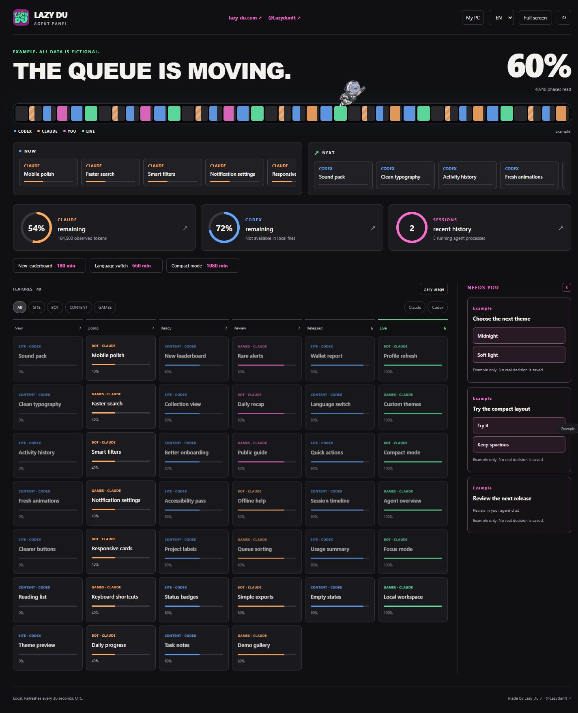

# Lazy Du Agent Panel

A local dashboard for Claude Code and Codex usage, sessions, and work in progress.

[Lazy Du](https://lazy-du.com) · [X / @Lazydunft](https://x.com/Lazydunft) · [Português](README.pt-BR.md)



## Features

- Automatic discovery of local Claude Code and Codex metadata.
- Usage limits, observed tokens, and recent sessions.
- Incremental scanning that keeps the interface responsive.
- Optional task board and queue with visual progress.
- English and Portuguese interface.
- Isolated demo mode with fictional data.
- No dependencies or telemetry.

## Quick start

With Node.js 20 or newer, run:

```sh
npx github:tridev360/lazy-du-agent-panel
```

Or ask Claude Code or Codex to start the panel for you.

For a downloaded copy:

**Windows:** double-click `panel.bat`.

**macOS / Linux:** run `node src/panel.cjs`, then open http://127.0.0.1:3251.

`npm start` works on all platforms. Try `node src/panel.cjs --demo` for the demo, or use the Example button.

## Privacy

Runs on your PC and listens only on localhost. Reads usage counters and timestamps from local session metadata, not conversation content or credentials. Process detection reads executable names only. There is no telemetry. Values that cannot be read show **?**.

## Optional task board

Run `node src/panel.cjs init example-workspace`, then `node src/panel.cjs --workspace example-workspace`.

The generated configuration points to Markdown tasks and a queue. A task can look like this:

```markdown
---
id: mobile-polish
owner: frontend
executor: codex
phase: doing
---

# Mobile polish
```

Use `new`, `open`, `doing`, `ready`, `review`, `released`, or `done` as the phase. Configure display names such as `frontend` and `backend` in `config.json`.

## FAQ

**Does it need an account or API key?** No. It uses metadata already on your PC.

**Can I access it remotely?** The server is local only.

**Can I change the port?** Run `node src/panel.cjs --port 3252`.

**How do I run the tests?** Run `npm test`.

## License

[MIT](LICENSE). Copyright (c) 2026 Lazy Du.
