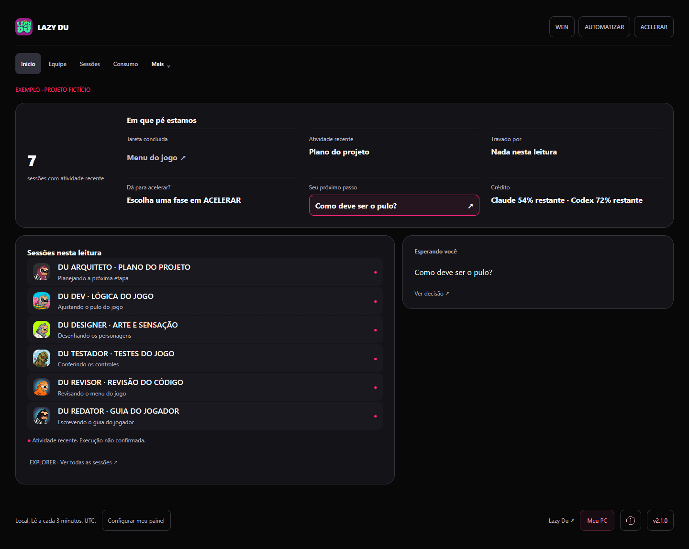
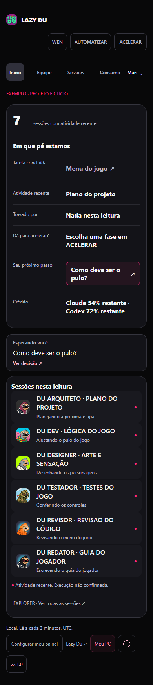

# Lazy Du Agent Panel 2.1

Acompanhe suas sessões do Claude Code e Codex em um painel local. Comece pequeno e troque de modo quando precisar de mais detalhes.

[English](README.md) · [Lazy Du](https://lazy-du.com)

## Abrir em menos de um minuto

Precisa de Node.js 20 ou mais recente. Baixe e extraia este repositório. Na pasta extraída:

~~~sh
node src/open.cjs
~~~

O atalho abre o navegador em http://127.0.0.1:3251. No Windows, você pode abrir panel.bat com dois cliques. No Mac, rode bash panel.command ou use o comando acima.

Escolha o tamanho do projeto e depois o que quer acompanhar. Um clique por escolha. Pode pular. Em Mais → Preferências, você troca o modo, o idioma e as opções de leitura quando quiser.

Sem conta, chave de API, instalação de pacote ou configuração do projeto. Claude Code ou Codex neste computador fornece os metadados reais. Se o perfil estiver vazio, o painel abre um exemplo fictício, identificado, depois de terminar a leitura. Em Mais → Exemplo, escolha uma pessoa ou um time maior.

Para ver só o exemplo, sem ler sessões locais:

~~~sh
node src/open.cjs --demo
~~~

Tudo fica neste computador. Fechar painel no rodapé encerra um atalho que tenha o fechamento habilitado. Fechar apenas a aba deixa o servidor ligado. Ctrl+C encerra o servidor aberto pelo código.

## Três modos

| Modo | Resumo inicial |
| --- | --- |
| BEGINNER | Até dois agentes, com seu próximo passo primeiro |
| EXPLORER | Até seis agentes, para um time pequeno |
| PRO | O projeto inteiro e os agentes disponíveis |

Todos mantêm acesso a Equipe, com os vínculos de origem conhecidos, Sessões, Consumo, Fila e Alimente sua IA. O modo muda o resumo inicial. Não cria, encerra nem envia ordens a agentes.

A abertura mostra sessões com atividade recente e seis linhas curtas. Atividade recente não comprova processo rodando. Conversa encerrada não é tarefa entregue. Tarefa concluída precisa de data registrada; exemplos fictícios identificam o progresso simulado. Crédito ausente aparece como Não disponível. Porcentagens dizem se são usadas ou restantes. Tokens e crédito são unidades diferentes.

Equipe mostra você no topo e o Claude Code e o Codex lado a lado, com cada sessão e os ajudantes que os metadados ligam a ela. Os fios levam pontinhos no sentido de quem mandou, na cor de quem mandou; fio parado fica sem pontos, e Movimento desligado ou movimento reduzido não mostram pontos. Clique num fio para ler quem trabalha com quem, em palavras simples.

Sessões mostra uma coluna por sessão só com metadados: estado, ação atual, ferramentas, modelo, tokens e projeto. Não lê nem manda mensagens. Consumo começa com uma linha de resumo, depois o total da semana, os copos, a estimativa lúdica de água e os anéis de crédito; Como calculamos explica cada número.

WEN abre o resumo atual. AUTOMATIZAR prepara um plano para copiar no chat da sua IA. Copiar o plano não inicia um agente. ACELERAR traz uma lista reutilizável, marchas selecionáveis, fases em ordem e esperas que você marca. Marcar uma fase ou escolher uma marcha só salva neste painel: não publica código, não muda sua conta de IA e não avisa seus agentes. Os minutos são esperas informadas por você, sem alegar ganho de velocidade medido.

## Ensinar minha IA e o sino

Ensinar minha IA, em Alimente sua IA e no guia inicial, mostra regras de trabalho opcionais para colar no CLAUDE.md ou no AGENTS.md. Primeiro escolha quem faz o quê: manter o seu jeito de hoje (o painel não muda nada e só mostra o que observou pelos nomes de ferramentas nas suas sessões), uma escolha personalizada com prós e contras curtos de cada IA, ou a recomendação. O painel só copia o texto. Ele nunca escreve nos seus arquivos.

O sino lista as novidades da versão e as dicas feitas neste computador, o que espera você e as decisões pedidas pelas suas IAs. As marcas de lido, e as telas que você abriu (usadas só para sugerir um recurso que você ainda não usou, no máximo um por dia), ficam neste navegador. As mensagens do autor vêm desligadas. Quando você liga, ou aperta Ver mensagens do autor, o servidor local baixa https://raw.githubusercontent.com/tridev360/lazy-du-agent-panel/main/news.json com um GET simples: sem identificador, sem cookie, com limite de 5 segundos e no máximo uma vez por dia quando ligado. O GitHub vê o seu IP como em qualquer download. Mandar feedback abre uma issue nova no GitHub no seu navegador; nada é enviado até você enviar por lá.

## Privacidade

O servidor escuta só no localhost. Lê metadados permitidos de .codex/sessions e .claude/projects no seu perfil: identificadores, origem conhecida, datas, modelo, esforço, nomes de ferramentas e contadores de tokens. Projeta esses campos sem decodificar corpos de conversas ou argumentos de ferramentas. Identificadores de sessão são resumidos por hash. O nome da pasta do projeto pode aparecer; o caminho completo fica privado. Sem telemetria nem credenciais: esta versão não manda dado de uso.

Consumo e preferências ficam locais. O cache guarda metadados projetados; esta versão invalida o cache anterior de conversas. As preferências do acelerador ficam em .lazy-du-panel/acceleration.json no seu perfil. Arquivo corrompido mostra erro sem ser sobrescrito.

Uma pasta opcional de tarefas pode ser ligada em Ligar minha pasta de tarefas, por exemplo na Fila. O painel lê arquivos .md que começam com um cabeçalho curto:

~~~md
---
phase: doing
---
# Desenhar o menu
~~~

Fases: new, open, doing, ready, review, released e done, ou nova, aberta, andando, pronta, revisão, liberado, feito e no ar. Campos opcionais do cabeçalho: title, owner, executor (claude ou codex), project, deadline, started_at e completed_at (datas ISO). Tarefa concluída só conta como entrega com completed_at. Arquivo sem cabeçalho fica de fora. Um decisions.md opcional lista uma decisão pendente por título numerado, como ## 1. Qual música combina com o menu? Títulos marcados com DONE ficam de fora. Não depende de serviço externo de estado.

Inglês, português e espanhol disponíveis. Respeita movimento desligado e movimento reduzido. A música opcional só conecta ao provedor depois do clique.

## Conferir

~~~sh
node --test --test-concurrency=1 test/*.test.cjs
~~~

Para conferir no navegador, use Playwright Core e Chromium já instalados em um executor isolado:

~~~sh
node tools/validate-public.cjs --playwright /caminho/playwright-core --browser /caminho/chromium --out /caminho/saida
~~~

OUTPUT_DIR também escolhe a pasta. PLAYWRIGHT_MODULE e CHROMIUM_PATH substituem os argumentos. O script grava tests.txt, validation.json e fotos fictícias em 1440, 768, 390 e 375 pixels. Usa perfis temporários vazios e metadados sintéticos, nunca suas sessões reais. Teste vermelho mantém a saída de erro, mesmo quando as fotos foram produzidas para revisão.

A build portátil do Windows é separada do uso pelo código. Precisa de Node 24 na máquina de build e postject em pasta isolada. Veja tools/build-windows.cjs. Este código não inclui executável; precisa de Node para rodar.

Autor: github.com/tridev360 · X @hallstrid

Licença MIT.
