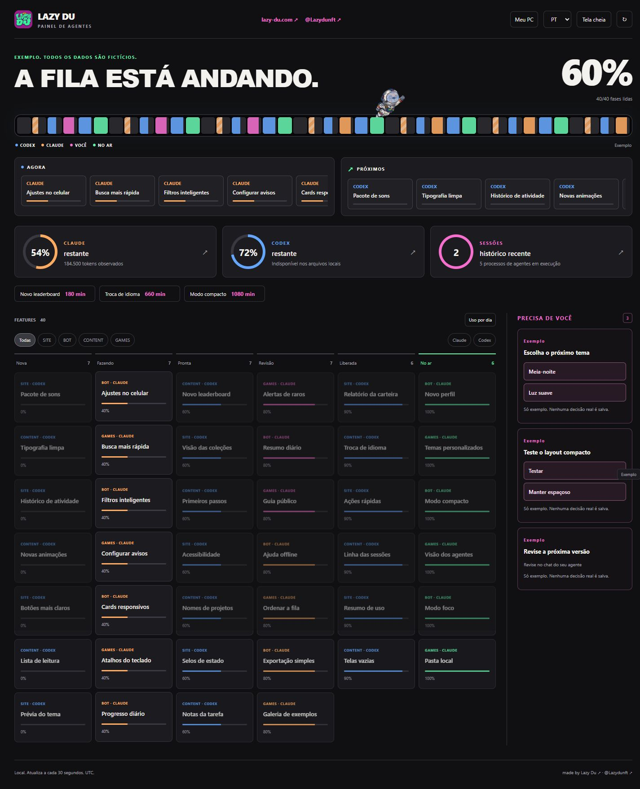

# Lazy Du Agent Panel

Um painel local para acompanhar uso, sessões e trabalho em andamento do Claude Code e do Codex.

[Lazy Du](https://lazy-du.com) · [X / @Lazydunft](https://x.com/Lazydunft) · [English](README.md)



## Recursos

- Descoberta automática de metadados locais do Claude Code e do Codex.
- Limites de uso, tokens observados e sessões recentes.
- Leitura incremental que mantém a interface responsiva.
- Quadro de tarefas e fila opcionais com progresso visual.
- Interface em português e inglês.
- Modo exemplo isolado com dados fictícios.
- Sem dependências ou telemetria.

## Início rápido

Com Node.js 20 ou mais recente, execute:

```sh
npx github:tridev360/lazy-du-agent-panel
```

Ou peça ao seu Claude Code ou Codex para abrir o painel.

Para uma cópia baixada:

**Windows:** abra `panel.bat` com dois cliques.

**macOS / Linux:** execute `node src/panel.cjs` e abra http://127.0.0.1:3251.

`npm start` funciona em todas as plataformas. Para ver a demonstração, use `node src/panel.cjs --demo` ou o botão Exemplo.

## Privacidade

Roda no seu PC e aceita conexões apenas locais. Lê contagens de uso e horários dos metadados de sessão, sem ler o conteúdo das conversas ou credenciais. A detecção de processos lê apenas nomes dos executáveis. Não há telemetria. Valores que não puderem ser lidos aparecem como **?**.

## Quadro de tarefas opcional

Execute `node src/panel.cjs init example-workspace` e depois `node src/panel.cjs --workspace example-workspace`.

A configuração gerada aponta para tarefas e uma fila em Markdown. Exemplo de tarefa:

```markdown
---
id: mobile-polish
owner: frontend
executor: codex
phase: doing
---

# Mobile polish
```

As fases são `new`, `open`, `doing`, `ready`, `review`, `released` e `done`. Configure nomes como `frontend` e `backend` no arquivo `config.json`.

## Perguntas frequentes

**Precisa de conta ou chave de API?** Não. Usa os metadados já disponíveis no PC.

**Posso acessar remotamente?** O servidor aceita apenas acesso local.

**Posso trocar a porta?** Use `node src/panel.cjs --port 3252`.

**Como executar os testes?** Use `npm test`.

## Licença

[MIT](LICENSE). Copyright (c) 2026 Lazy Du.
